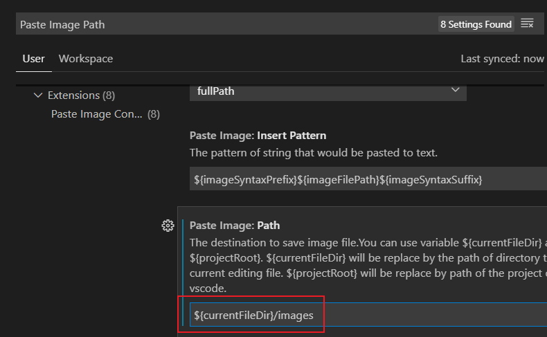

# 一级标题
## 二级
### 三级

[TOC]

正文

正文

-----
**重点加粗**
*斜体*
~~删除线~~
==高亮==

---

列表：

* 无序列表
  * 嵌套无序列表
  * 嵌套无序列表
* 无序列表

---

1. 有序列表 1
   1. 嵌套有序列表1
   2. 嵌套有序列表2
2. 有序列表2
---
引用文本：
>引用
>again

---
**行内代码**
``` python{.line-numbers}
print("Hello，world！")
```

---
[超链接](225)



---
- [] 已经完成
- [x] yijing1

---
表格：
|表头1|表头2|
|---|---|
|AA|BB|
|^ |DD|

当前行<!--注释多行-->

行内公示：
单位圆 $x^2+y^2=1$

**公式块**
$$
\begin{cases}
x=\rho\cos\theta \\
y=\rho*\sin/\theta\text{中文} \\
\end{cases}
$$

下标：$x_2+y_2=1$
$Co_3CaO_2$
$\frac{x^2}{y_3}$

$\displaystyle\frac{x^56}{y_2}$
$x^{265}$
$Cao^{2}$
$\sqrt{2}$
开$n$次方：$\sqrt[n]{2}$
$\sqrt[2]{9}$
 
 ---
 ==**空格**==
$a\quad b$


$\sum_{k=1}^n\frac{1}{k}  \quad  \displaystyle\sum_{k=1}^n\frac{1}{k}$

---
$\sum_(3+5)$
$\displaystyle /left(\sum_{k=1}^{n}\frac{1}{k} /right)^2$
\frac{d}{dx}(x^3+x^2+1)
$\begin{vmatrix}5&5  \\4&3  \\\end{vmatrix}$